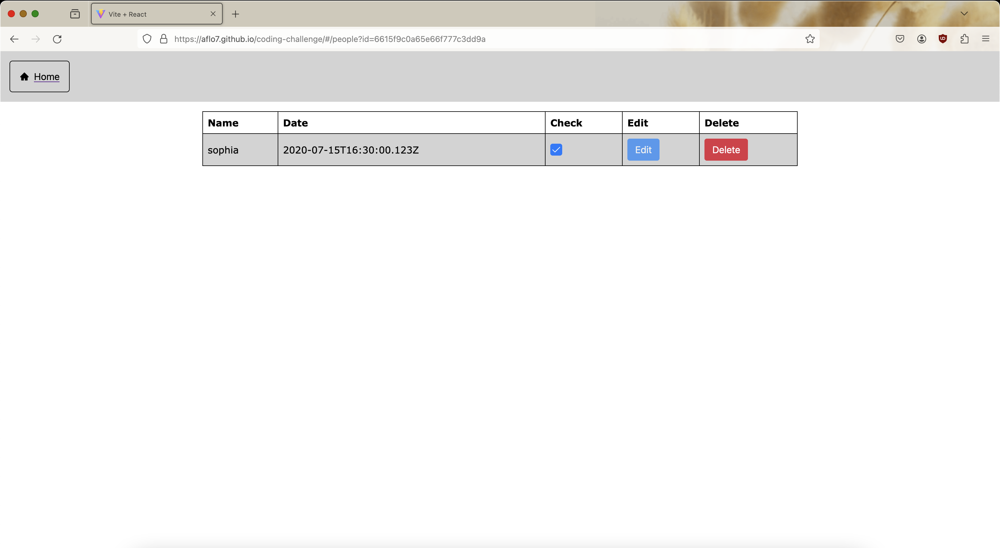

See the deployed webpage here: https://aflo7.github.io/coding-challenge/

I made this application using technologies like react, js, html, and css. within React, i used libraries like axios, prime react, react router, etc. it's a "single page application" and is extremely quick. features i've added to the application so far include search, delete, and create. the application is centered around searching for people, deleting people, and creating new people. I have created pages and forms for these three operations. the application has "Create, Read, and Delete" functionality. I have yet to add Update/Edit functionality. I feel this is the toughest part and will take a while. I spent 2 days to build this application. My knowledge of React helped me build the application quickly.

The application was made using Vite bundler. I chose to make a basic React project as it's an easy library to use.

Homepage screenshot: 

this page allows navigation to other pages of the site. it has buttons to go to the search page, delete page, and create page. The user can click the home button in the navigation bar to return to this page whenever. The homepage contains links to other pages on the site. the url to go to this page is https://aflo7.github.io/coding-challenge/#

All People Search: 

see a list of all of the people from the API. records from the API are fetched and displayed on this page. the url to go to this page is https://aflo7.github.io/coding-challenge/#/people/all

Single Person Screenshot: 

This page allows the user to view a single person in the database. The persons name, checked property, and options to edit and delete the person are shown on this page. The delete functionality works as expected. After a user deletes a person, the application navigates back to the homepage. After deletion of a person, the changes are reflected in the backend database. The edit functionality is yet to be implemented. I used a React hook called 'useSearchParams' to get the person's ID in the query string.

